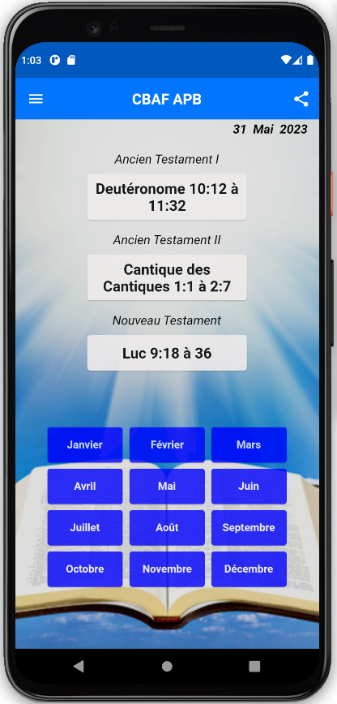
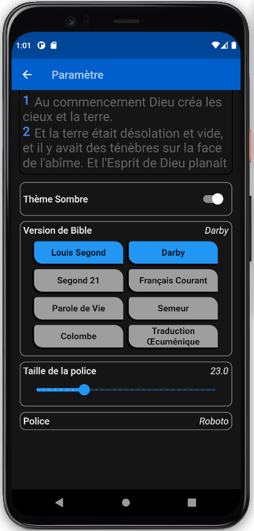

# Application de la Bible avec Calendrier de Lecture Biblique

Une application pratique pour lire la Bible et suivre un calendrier de lecture biblique.

    

## Fonctionnalités principales

- Calendrier de Lecture Biblique : Suivez un plan de lecture biblique pour une étude régulière de la Bible.
- Lecture de la Bible : Accédez facilement aux textes bibliques et naviguez à travers les chapitres et les versets.
- Recherche de versets : Trouvez des passages spécifiques en utilisant la fonction de recherche intégrée.
- Personnalisation : Choisissez parmi différentes traductions de la Bible et personnalisez l'apparence de l'application selon vos préférences.

## Installation et Configuration

1. Assurez-vous d'avoir Flutter et Dart installés sur votre machine. Vous pouvez trouver les instructions d'installation de Flutter [ici](https://flutter.dev/docs/get-started/install).
2. Clonez ce dépôt sur votre machine locale en utilisant la commande suivante :
    git clone https://github.com/votre-nom-utilisateur/votre-depot.git
3. Accédez au répertoire du projet : `cd votre-depot`
4. Installez les dépendances requises en exécutant la commande suivante :
5. Lancez l'application sur un émulateur ou un appareil connecté en utilisant la commande suivante : `flutter run`

## Utilisation de l'Application

- Consultez le calendrier de lecture pour suivre le plan de lecture biblique recommandé.
- Sélectionnez un livre de la Bible dans le menu de navigation.
- Naviguez à travers les chapitres et les versets pour lire les passages bibliques.
- Utilisez la fonction de recherche pour trouver des versets spécifiques.
- Utilisez les marques-pages pour enregistrer des versets importants.

## Contribution

Les contributions sont les bienvenues ! Si vous souhaitez contribuer à ce projet, veuillez suivre ces étapes :

1. Fork ce dépôt et clonez-le sur votre machine locale.
2. Créez une nouvelle branche pour vos modifications : `git checkout -b ma-nouvelle-fonctionnalite`.
3. Effectuez les modifications nécessaires et testez-les.
4. Soumettez une demande de pull avec une description claire de vos modifications.

## Fonctionnalités à venir
- Marque-pages : Marquez des versets importants ou des passages pour y accéder rapidement.
- 16 différentes version de bible en français
- Ajout des version anglaise
- Dictionnaire
- Commentaire
- Assistance virtuelle
- etc...

## Licence

Ce projet est sous licence Creative Commons Attribution-NonCommercial 4.0 International (CC BY-NC 4.0). Veuillez consulter le fichier `LICENSE` pour plus de détails.

## Auteur

- HOVOZOUNKOU Ebénézer - [@EbenezerH](https://github.com/EbenezerH)

---

Merci d'utiliser notre application de la Bible avec Calendrier de Lecture Biblique. Nous espérons qu'elle vous aidera dans votre étude et votre compréhension de la Parole de Dieu. Si vous avez des questions ou des commentaires, n'hésitez pas à nous contacter.

